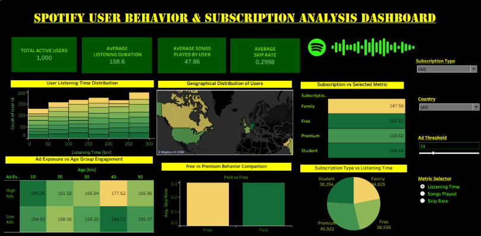

# 🎵 Spotify User Behavior & Subscription Analysis

## 📌 Project Overview
This Tableau project analyzes Spotify user behavior and subscription engagement patterns using interactive visualizations and KPIs.

The dashboard provides insights into:
- User listening behavior
- Subscription performance
- Skip rate analysis
- Geographic user distribution
- Ad exposure impact
- Engagement comparison between Free and Premium users

---

## 📊 Dashboard Preview

---

## 🎯 Objectives
1. Analyze Spotify user listening patterns.
2. Compare user engagement across subscription plans.
3. Study the relationship between ads and listening behavior.
4. Identify trends using interactive Tableau visuals.

---

## 🛠️ Tools & Technologies
- Tableau
- Microsoft Excel
- Data Visualization
- KPI Analysis

---

## 📁 Dataset Information
The dataset contains:
- User demographics
- Subscription type
- Listening duration
- Songs played per day
- Skip rate
- Device type
- Ads listened per week

Total Records: **1000**

---

## 📈 Dashboard Features
- KPI Cards
- Histogram
- Interactive Map
- Bar Charts
- Pie Chart
- Highlight Table
- Dynamic Parameters
- Calculated Fields

---

## 🔍 Key Insights
### User Listening Patterns
- Users with longer listening time tend to play more songs and skip fewer tracks.
- Younger and middle-aged users show higher engagement levels.

### Subscription Analysis
- Premium and Family users show better engagement with lower skip rates.
- Free users experience higher skips due to ads and feature limitations.

---

## 📚 Dataset Source
Spotify Dataset for Churn Analysis from Kaggle:

https://www.kaggle.com/datasets/nabihazahid/spotify-dataset-for-churn-analysis

